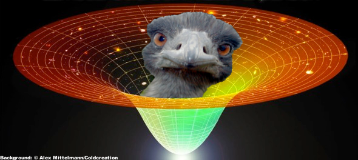

# Cosmic Emu

## Description

The Cosmic Emu produces predictions for the matter power spectrum based on eight cosmological parameters: omega_m, omega_w, sigma_8, h, n_s
w_0, w_a, and omega_nu. These predictions, based on Gaussian process emulation, approximate the power spectra that would be obtained from large dark matter simulations. The details are provide in "The Mira-Titan Unverse: Precision Predictions for Dark Energy Surveys" (https://arxiv.org/abs/1508.02654) and an upcoming paper. The Cosmic Emu gives predictions for both the dark matter power spectrum and the total power spectrum (dark matter plus neutrino).

## Getting Started

The Cosmic Emu requires the GNU Scientific Library (GSL). The makefile for both spectrum emulators includes lines to point to your installation of the GSL. For spectrum emulator, there are two files in addition to the makefile: emu.c and params.h. Simply type "make" at the command line to compile. The resulting program emu.exe is intended to be a demonstration of how to use the emulator. This program looks for a file called "xstar.dat" which should have nine space-delimited numbers on each line:

'\omega_m'   '\omega_b'   '\sigma_8'   'h'   'n_s'   'w_0'   'fw'   '\omega_{\nu}'   'z'

Running "emu.exe" will produce a prediction for each line in xstar.dat.

## Copyright and License

Los Alamos National Security, LLC owns the copyright for this code, identified internally as LA-CC-17-014. Please see LICENSE for copyright details.
